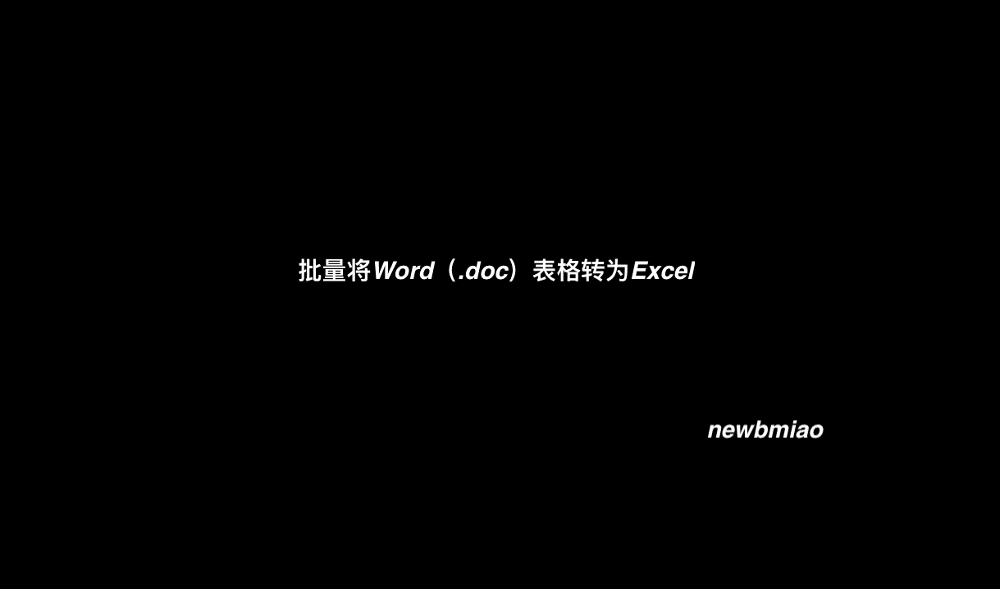
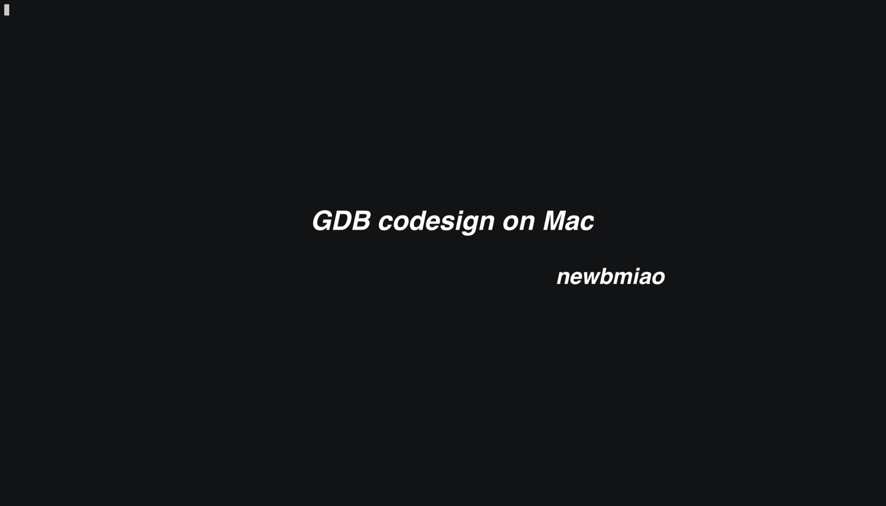

# free-hands-tips

> 不限技术，只为解决问题。

记录一些解放双手、提升效率的小技巧

## 目录

- [doc2xlsx](https://github.com/NewbMiao/free-hands-tips#doc2xlsx)
- [gdb-go](https://github.com/NewbMiao/free-hands-tips#gdb-go)

---

## doc2xlsx

**批量转换Word（.doc）到 Excel**

`doc`文件转为`xlsx`，可以先转为`docx`或`html`，然后用[pandas](https://www.pypandas.cn/)包转

mac上利用`applescript`实现`doc`批量另存为`docx`或`html`



> 第一次选择目录后需要点击授权目录权限。
>
> Word另存运行过程在后台，动图上没显示出来，实际Word窗口会一次次打开-另存-关闭。

转换Excel提供了两种示例：

- [doc2docx2xlsx](doc2docx2xlsx) : 批量将Word一个个转为对应Excel
- [doc2html2xlsx](doc2html2xlsx) : 批量将所有html表格合并到同一个Excel中不同sheet

> 对应目录下shell可直接运行，第一次运行可能需要安装对应python包
>
> `pip3 install pandas xlsxwriter docx Document`

## gdb-go

[代码](gdb-go/)

- docker

[](https://asciinema.org/a/302911)

具体步骤如下：

```go
// 1. 已当前目录映射启动gdb
docker run --rm -it --security-opt="apparmor=unconfined" \
  --security-opt="seccomp=unconfined"  \
  --cap-add=SYS_PTRACE -v "$(pwd):/go/src/app" \
  newbmiao/gdb-go1.14rc1:latest bash

// 2. 编译go，不使用compressdwarf 、inline and escape
go build -ldflags=-compressdwarf=false -gcflags=all="-N -l" -o test test.go

// 3. 可以愉快的debug了
gdb ./test
```

- mac

步骤：

- 创建系统证书 `gdb-cert`



- gdb代码签名
已创建脚本，直接执行：

`sh debugger/gdb/installMac.sh`

- gdb调试（方式同docker篇）

> 证书相关具体参见：[PermissionsDarwin](https://sourceware.org/gdb/wiki/PermissionsDarwin#Create_a_certificate_in_the_System_Keychain)
